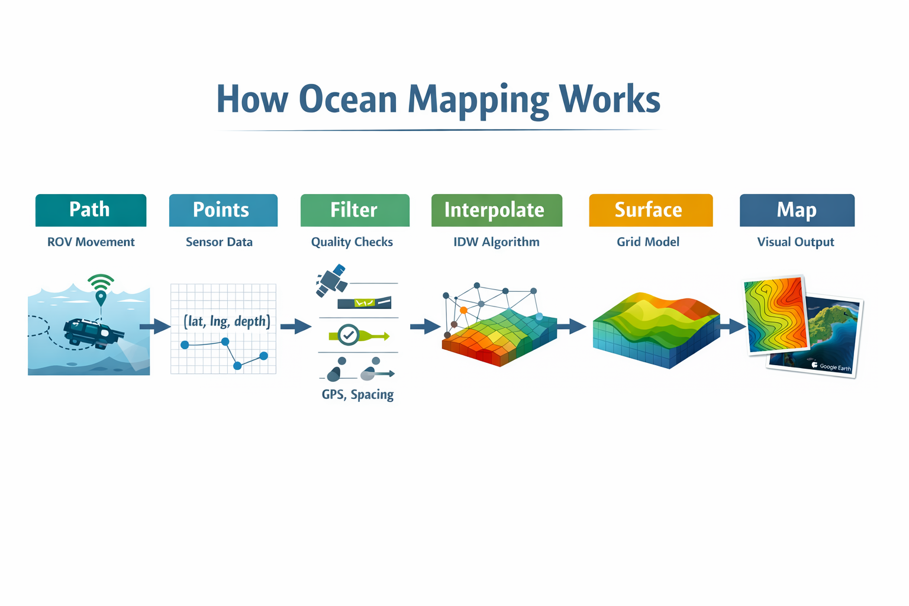
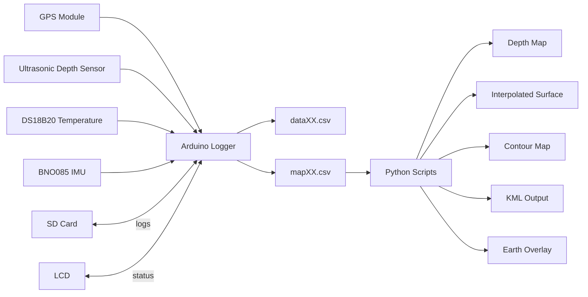

<p align="center">
  
</p>

<p align="center">
  <em>Data pipeline from ROV movement to bathymetric surface generation.</em>
</p>

## Quick Start

```bash
python csv_to_png_depth_points.py MAP00.csv
python csv_to_png_depth_interpolated.py MAP00.csv
python csv_to_png_depth_contours.py MAP00.csv
python csv_to_kml_points_colored.py MAP00.csv
python csv_to_kmz_depth_overlay.py MAP00.csv
```
---
# Oceanic Measurement & Environmental Geospatial Array

A compact underwater survey system that collects depth, position, and environmental data from a moving ROV and converts those measurements into bathymetric maps and georeferenced outputs.
Measurements are filtered in real time using quality and spatial constraints, producing both a complete log and a reduced mapping dataset. A continuous surface is generated from the filtered points through spatial interpolation.

---

## Overview

The system is built around an **Arduino-based capture device** and a **Python-based processing workflow**.

It is designed to:

- record reliable field data in real time  
- filter out low-quality measurements  
- generate usable spatial maps from irregular samples  
- visualize results as raster maps and georeferenced overlays  

---

## Repository Structure

```text
arduino/
  rov_logger_mapping.ino

docs/
  SYSTEM.md
  SCRIPTS.md

scripts/
csv_to_png_depth_points.py 
csv_to_png_depth_interpolated.py 
csv_to_png_depth_contours.py
csv_to_kml_points_colored.py 
csv_to_kmz_depth_overlay.py

example_data/
  MAP00.CSV
````

---

## System Architecture



---

## Architecture Overview

| Layer                   | Function                                                                    |
| ----------------------- | --------------------------------------------------------------------------- |
| **Capture (Arduino)**   | GPS (position + UTC), sonar depth, temperature, IMU orientation, SD logging |
| **Processing (Python)** | CSV parsing, filtering, interpolation (IDW), contour generation             |
| **Output**              | Depth maps, contour maps, KML files, Google Earth overlays                  |

---

## Hardware

### Components

* Arduino Mega
* GPS module (UART)
* Waterproof ultrasonic distance sensor
* DS18B20 temperature sensor
* BNO085 IMU
* I2C 16×2 LCD
* SD card module

---

### Wiring Summary

| Component          | Connection         |
| ------------------ | ------------------ |
| GPS                | RX1 (19), TX1 (18) |
| Ultrasonic         | RX2 (17), TX2 (16) |
| SD Card            | CS pin 53          |
| Temperature Sensor | Pin 6              |
| LCD / IMU          | SDA (20), SCL (21) |

---

## Data Pipeline

### 1. Data Capture

The Arduino logger writes two files:

* **`dataXX.csv`** — complete system log (diagnostics)
* **`mapXX.csv`** — filtered survey dataset

Mapping points are recorded only when the system detects:

* valid GPS fix
* acceptable HDOP
* sufficient satellite count
* recent fix age
* valid depth reading
* stable orientation (pitch/roll)
* acceptable platform speed
* minimum spacing from the previous point

---

### 2. Processing

Run scripts on the mapping dataset:

```bash
python csv_to_png_depth_points.py MAP00.CSV
python csv_to_png_depth_interpolated.py MAP00.CSV
python csv_to_png_depth_contours.py MAP00.CSV
python csv_to_kml_points_colored.py MAP00.CSV
python csv_to_kmz_depth_overlay.py MAP00.CSV
```

---

### 3. Outputs

* **Scatter map** — validation of raw coverage
* **Interpolated map** — continuous surface model
* **Contour map** — readable bathymetry
* **KML + overlay** — georeferenced visualization

---

## Key Features

### UTC Time Logging

All timestamps are recorded in UTC to eliminate timezone ambiguity.

### Depth Smoothing

A moving average filter reduces sonar noise and rejects transient spikes.

### Sound Speed Correction

Depth is adjusted using a temperature-based estimate of sound speed.

### Real-Time Data Filtering

Measurements are evaluated during acquisition to ensure mapping data meets defined quality thresholds.

### Spatial Interpolation

Inverse Distance Weighting (IDW) converts discrete samples into continuous surfaces.

---

## Data Format

### Mapping File (`mapXX.csv`)

```csv
point,date_utc,time_utc,lat,lng,depth_cm,temp_c,satellites,hdop,speed_kmph,fix_age_ms,pitch_deg,roll_deg,imu_acc
```

---

## Outputs at a Glance

- `dataXX.csv` — complete acquisition log
- `mapXX.csv` — filtered survey dataset
- `*_depth_map.png` — raw point coverage
- `*_interpolated.png` — interpolated surface
- `*_contours.png` — contour visualization
- `*_colored.kml` — colorized Google Earth points
- `*_overlay.kmz` — Google Earth ground overlay

---

## Example Workflow

```bash
python csv_to_png_depth_points.py MAP00.csv
python csv_to_png_depth_interpolated.py MAP00.csv
python csv_to_png_depth_contours.py MAP00.csv
python csv_to_kml_points_colored.py MAP00.csv
python csv_to_kmz_depth_overlay.py MAP00.csv
```
---

## Example Output

Running the scripts produces:

* `*_depth_map.png`
* `*_interpolated.png`
* `*_contours.png`
* `*_colored.kml`
* `*_overlay.kmz`
---

## Method

This project implements a self-contained bathymetric survey system using a mobile ROV platform.

As the device moves, it continuously samples depth, position, and environmental data. Each measurement is evaluated in real time against defined quality constraints, including GPS validity, HDOP, satellite count, fix age, platform orientation, and spatial separation.

The system produces two datasets:

* a complete log (`dataXX.csv`) containing all measurements
* a filtered mapping dataset (`mapXX.csv`) containing only survey-quality points

The mapping dataset is generated by enforcing minimum spacing between points and rejecting measurements that do not meet stability or accuracy thresholds.

A continuous surface is constructed from the filtered dataset using spatial interpolation (Inverse Distance Weighting). The resulting map is a derived model, determined by sampling density, platform motion, and filtering criteria rather than direct sensor output.

This architecture separates acquisition, validation, and surface reconstruction into distinct stages, allowing control over data quality during both capture and processing.

---

## Limitations

* Ultrasonic sensors have beam spread and limited range underwater
* GPS accuracy limits spatial resolution
* Sound speed correction uses temperature only
* Interpolation produces a modeled surface, not direct observation
* Map quality depends on survey spacing, speed, and stability

---

## Future Improvements

* pressure-based depth sensor integration
* salinity-aware sound speed correction
* real-time mapping preview
* automated survey path planning
* higher-resolution interpolation methods
* contour labeling and hillshading
* live telemetry and visualization

---

## Documentation

[System Documentation](docs/SYSTEM.md)
